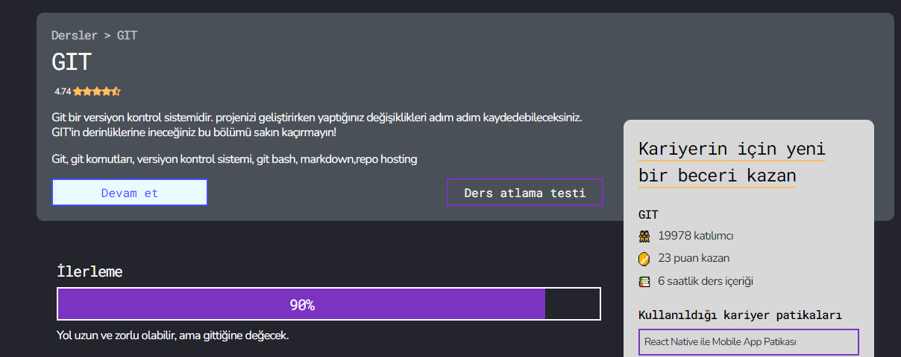

# *KOD*

## **KODLAMAK**

## ***KODLUYORUZ***

* liste1
* liste2
* liste3
    * alt liste
        * alt listenin alt listesi
-------------------------------------

[tıklayarak kendi patikana başlayabilirsin](http://app.patika.dev)

```python
print("hello world")

```
```javascript
console.log("kodluyoruz")
```
# KODLUYORUZ İLK REPO TEST
Bu benim ilk repom, test amaçlı olmakla birlikte kodluyoruz ekibinin emekleri vesilesiyle gerçekleşmiştir.

## Installation
https://github.com/MustafaKarakuzu/kodluyoruzilkrepotest.git

-------------------------------------

Bu ders serisini hazırlayan herkese teşekkürler.


